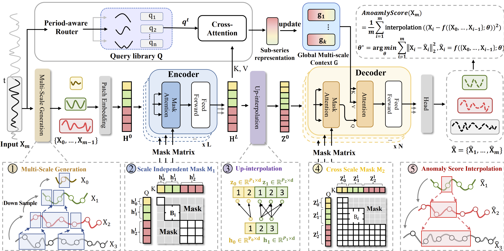
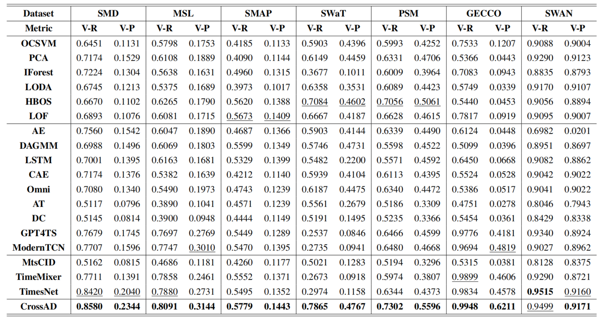
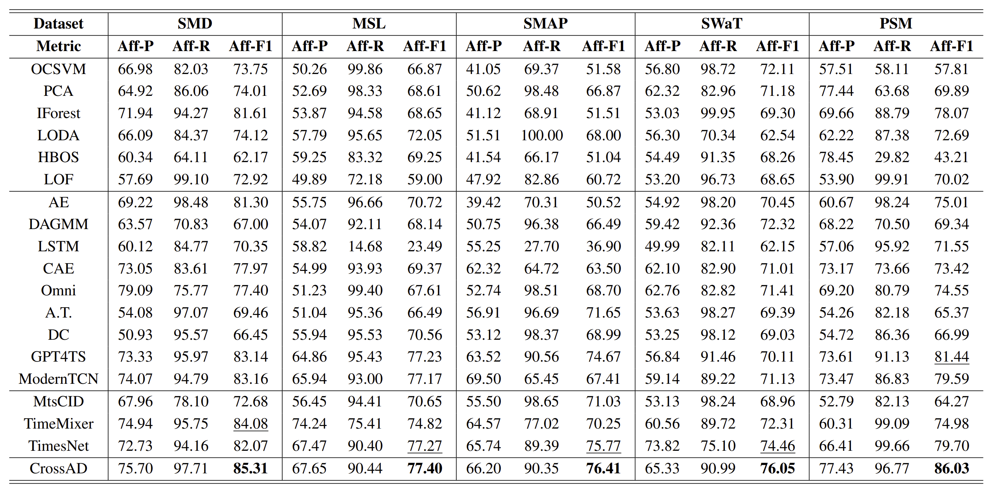

This code is the official PyTorch implementation of our NeurIPS'25 Paper: [CrossAD: Time Series Anomaly Detection with Cross-scale Associations and Cross-window Modeling](https://arxiv.org/abs/2510.12489).

If you find this project helpful, please don't forget to give it a ⭐ Star to show your support. Thank you!

## Introduction
We propose CrossAD, a novel framework for time series **A**nomaly **D**etection that takes **Cross**-scale associations and **Cross**-window modeling into account. We propose a cross-scale reconstruction that reconstructs fine-grained series from coarser series, explicitly capturing cross-scale associations. Furthermore, we design a query library and incorporate global multi-scale context to overcome the limitations imposed by fixed window sizes.
Extensive experiments conducted on seven real-world datasets using nine evaluation metrics validate the effectiveness of CrossAD, demonstrating state-of-the-art performance in anomaly detection.



## Quickstart
### Folder structure
```
.
|-- README.md
|-- configs
|   |-- GECCO
|   |-- MSL
|   |-- PSM
|   |-- SMAP
|   |-- SMD
|   |-- SWAN
|   |-- SWAT
|   |-- TSB-AD-U
|   `-- UCR
|-- data_provider
|   |-- __init__.py
|   |-- data_provider.py
|   `-- data_provider_UCR.py
|-- dataset
|   |-- DETECT_META.csv
|   |-- TSB-AD
|   |-- UCR_Anomaly_FullData
|   `-- data
|-- exp
|   |-- exp_TSBAD.py
|   `-- exp_anomaly_detection.py
|-- figs
|   |-- affiliation.png
|   |-- main.png
|   `-- vus.png
|-- models
|   `-- CrossAD
|-- requirements.txt
|-- run.py
|-- run_TSBAD.py
|-- run_UCR.py
|-- scripts
|   |-- test
|   `-- train
|-- test_results
|   |-- GECCO
|   |-- MSL
|   |-- PSM
|   |-- SMAP
|   |-- SMD
|   |-- SWAN
|   |-- SWAT
|   |-- TSB-AD-U
|   `-- UCR
`-- ts_ad_evaluation
    |-- __init__.py
    |-- accomplish_UCR
    |-- affiliation
    |-- auc_vus
    |-- evaluator.py
    |-- f1
    |-- pate
    `-- spot.py
```
### Installation
```
pip install -r requirements.txt
```
### Data preparation
Prepare Data. You can obtained the well pre-processed datasets at https://drive.google.com/file/d/1YU_d9kIaP2EubyUhGWOwSKAhJxNntB8W/view?usp=sharing. 
Then place the downloaded data under the folder ```./dataset/```.
```
dataset
|   |-- DETECT_META.csv
|   |-- TSB-AD
|   |-- UCR_Anomaly_FullData
|   `-- data
```
### Train and evaluate model
1. The model structure of **CrossAD** under the folder ```./models/CrossAD/```
2. We provide the scripts for CrossAD under the folder ```./scripts/```. For example you can reproduce a experiment result as the following:
```bash
sh ./scripts/test/GECCO.sh
```
If there is no model weight, please execute the following script:
```bash
sh ./scripts/train/GECCO.sh
```
## Results
Results in the seven real-world datasets. The V-R and V-P are the VUS-ROC and VUS-PR, that higher indicate better performance. The best ones are in **bold**, and the second ones are underlined.



The affiliation metric results for the five real-world datasets are as follows.



## Citation
```
@inproceedings{CrossAD,
  title     = {{CrossAD}: Time Series Anomaly Detection with Cross-scale Associations and Cross-window Modeling},
  author    = {Li, Beibu and Shentu, Qichao and Shu, Yang and Zhang, Hui and Li, Ming and Jin, Ning and Yang, Bin and Guo, Chenjuan},
  booktitle = {NeurIPS},
  year      = {2025}
}

@inproceedings{DADA,
title      = {Towards a General Time Series Anomaly Detector with Adaptive Bottlenecks and Dual Adversarial Decoders},
author     = {Shentu, Qichao and Li, Beibu and Zhao, Kai and Shu, Yang and Rao, Zhongwen and Pan, Lujia and Yang, Bin and Guo, Chenjuan},
booktitle  = {ICLR},
year       = {2025}
}
```

## Community Support | Acknowledgements

This project is built on the shoulders of the open-source community.  
Special thanks to the authors and contributors of the following repositories:

- [decisionintelligence/TAB](https://github.com/decisionintelligence/TAB) – large-scale time-series anomaly benchmark with standardized data, metrics, and reproducible experiments.
- [TheDatumOrg/TSB-AD](https://github.com/TheDatumOrg/TSB-AD) – a comprehensive benchmark and evaluation protocol for time-series anomaly detection.
- [thuml/Time-Series-Library](https://github.com/thuml/Time-Series-Library) – comprehensive and reproducible deep-learning baselines for time-series tasks.  

